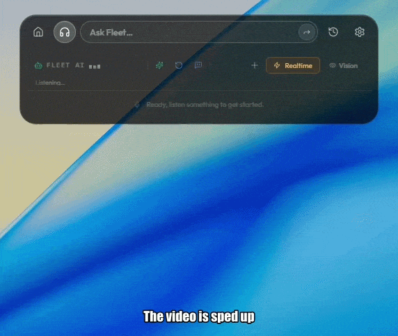
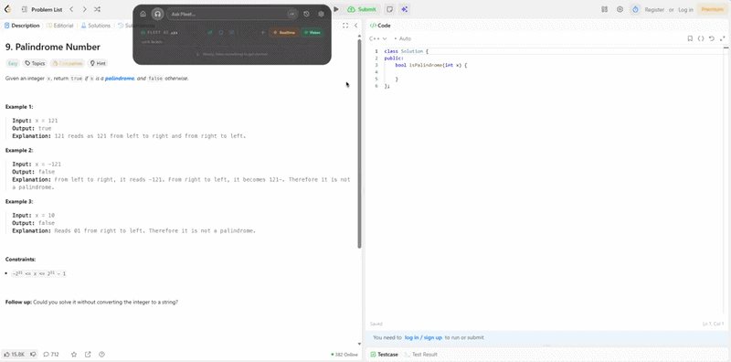
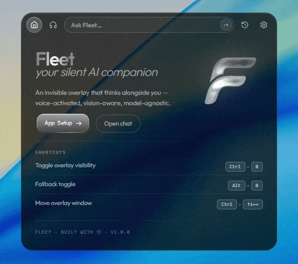

#  Fleet

**Real-time AI interview copilot. Built on Rust. Not Electron.**

---

Most interview AI tools are Electron wrappers around a cloud API call with a floating window on top. Fleet is not.

Fleet is a **native desktop application** that captures your audio in real time, transcribes it locally on your GPU, understands what's happening in the conversation on its own, and feeds intelligent responses to you, all while staying completely invisible on screen share.

---

## Why Fleet is different

### It doesn't wait for you to ask

Every other interview copilot works the same way: you listen to a question, you panic, you click "Get Help", and everyone on the call sees your mouse move to a corner of your screen. That click is detectable. That pattern is obvious.

Fleet is different. It has a built-in NLP engine that listens to the conversation in real time and **automatically decides** when something worth responding to has been said. When the interviewer finishes a technical question, Fleet already has a response forming — you didn't have to touch anything. No suspicious cursor movement. No manual trigger. Just the answer appearing when you need it.

---

### Local speech recognition — no cloud, no delay

Most competitors quietly send your audio to a cloud speech API. That means latency, a dependency on your internet connection, and your conversation going through someone else's server.

Fleet runs **Whisper locally on your GPU**. Your audio never leaves your machine. Transcription happens in real time, offline, and it's more accurate than most cloud solutions because Whisper is simply a better model. If you don't have a GPU, it falls back to CPU automatically.

On top of Whisper, Fleet runs a two-stage voice detection system that filters out keyboard noise, fan hum, and background sounds before transcription even starts. You get clean transcripts without random noise showing up as words.

---

### Not Electron. Actually fast.

Cluely. Final Round AI. Most tools in this space — Electron apps. That means they're shipping a full Chromium browser inside your interview tool, which means hundreds of megabytes of RAM just for the shell, slow startup, and a process list that looks suspicious.

Fleet is built on **Tauri**, a Rust-based native app framework. The binary is small. Cold start is under a second. RAM usage is a fraction of what Electron tools consume. This matters when your laptop is already running a video call, your IDE, and a browser — you can't afford another Chromium instance eating your resources.

---

### Invisible — actually invisible

Fleet doesn't just position a window off-screen. It uses OS-level APIs to hide itself from screen recording software, OBS, and any capture tool your interviewer might be running.

Beyond that:

- **Process disguise** — Fleet can masquerade as File Explorer in Task Manager. If someone asks you to share your screen and look at running processes, Fleet isn't there. (WIP, it's hidden enough, but the name is still visible in deep Task Manager as a process)
- **No taskbar presence** — no badge, no blinking icon, nothing that breaks your "I'm focused" facade
- Content protection is applied at the OS level, not via CSS tricks

---

### Smart contextual hints — not just raw answers

Fleet doesn't just dump a wall of text at you. Every response comes with **action pills** — short clickable suggestions for what to do next: "Ask about tradeoffs", "Show a code example", "Explain time complexity". These are generated by a separate AI call running in parallel with the main response, so they're ready the moment the answer appears.

The main response itself follows a real interview workflow when coding is involved: verbal approach first, complexity next, then clean code. Not a code dump with no explanation.

---

### Screenshot analysis for coding problems

Capture any visible coding problem with a single shortcut or enable the **Vision mode** so Fleet auto-captures the display. Fleet grabs the screen, reads the problem with a vision model (fallbacks OCR if LLM doesn't support vision), and returns a full solution with explanation. Works on LeetCode, HackerRank, CoderPad, or any browser-based environment. The overlay never shows up in what the interviewer sees.

---

### Setup is actually simple

Fleet ships with base Whisper model built in. You pick it, load it once, and you're done. No accounts. No API keys required if you run Ollama locally.

If you want cloud AI:
- Drop in an OpenAI, Groq, Gemini, Anthropic, or OpenRouter key in settings
- Pick your model
- Done

Groq is free-tier, extremely fast, and works well for live interview use. It's a good default if you don't want to pay for anything.

---

### Any LLM. Swap mid-session.

| Provider | Mode |
|---|---|
| Ollama | 100% local, no key needed |
| Groq | Free tier, fastest cloud option |
| OpenAI | I don't think it's that good but you can use it if you want |
| Anthropic | Claude — best for reasoning |
| Google Gemini | Huge context window |
| OpenRouter | Access to hundreds of models |

You can switch models from settings without restarting.

---

## What Fleet covers

- **Technical interviews** — real-time answers to algorithms, system design, debugging, architecture questions
- **Behavioral interviews** — contextual answers that sound like a person, not a chatbot
- **Coding rounds** — screenshot any problem, get a solution with explanation and complexity
- **Sales and client calls** — real-time context without ever looking away from the screen
- **Any meeting** — rolling conversation memory means Fleet stays relevant across a long call, not just the last sentence

---

## Comparison

| | Fleet | Most copilots |
|---|---|---|
| Speech recognition | Local Whisper (GPU) | Cloud API |
| Auto-response (no click needed) | ✅ | ❌ |
| Invisible to screen capture | ✅ OS-level | ⚠️ CSS/window tricks |
| Local AI (no API key) | ✅ Ollama | ❌ |
| App framework | Rust / Tauri | Electron |
| Binary size | Small | 200MB+ |
| RAM usage | Low | High (Chromium overhead) |
| Audio goes to cloud | ❌ Never | ✅ Always |

---

## Requirements

- Windows 10/11 or macOS 12+
- GPU (Nvidia or Metal) recommended for best transcription speed — CPU works too
- Ollama (optional, for fully local inference)

---

## Pricing & Sustainability

Fleet is not open source, but it is and will always be **free to use with your own setup**.

Here's how it works:

- **Local mode (Ollama) — always free, no limits.** If you run your own models locally, Fleet will never charge you anything. No usage caps, no paywalls, no nag screens. That's a permanent commitment.
- **Managed cloud models (coming) — credits-based.** At some point Fleet will offer built-in access to cloud models without you needing your own API key. This will be credits-based — pay for what you use, no subscription. This is the model that keeps development going. It's optional. You can ignore it entirely if you already have keys or run locally.

The short version: if you're willing to spend 5 minutes setting up Ollama or pasting an API key, Fleet costs you nothing. The credits model exists for people who want zero setup and are fine paying a small amount for that convenience.

No dark patterns. No features locked behind a paywall. No bait-and-switch.
